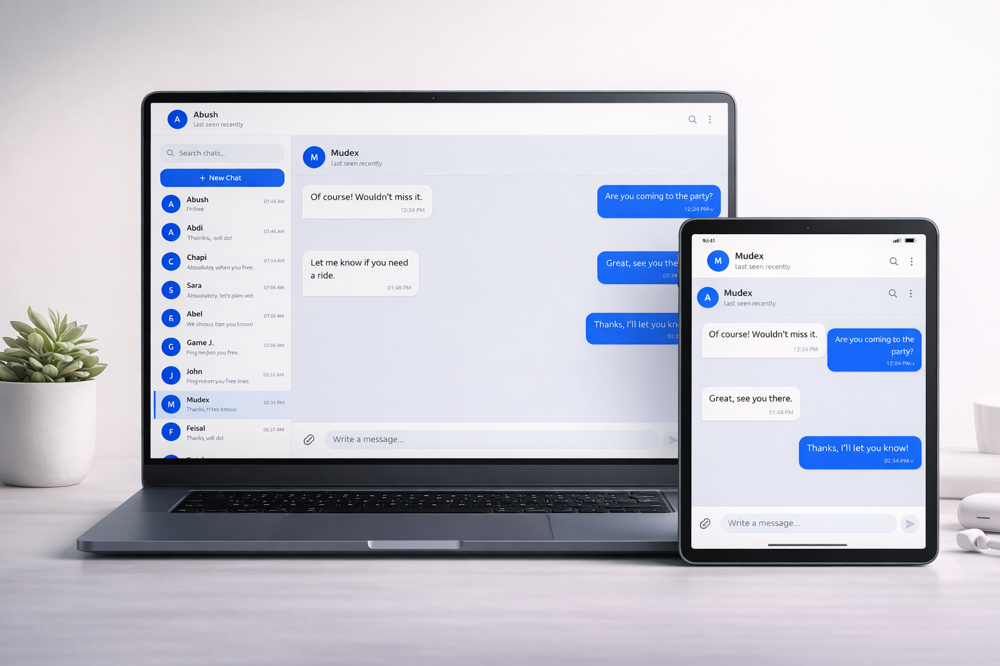

# TeleChat: Real-Time Telegram-Style Chat Application

<p align="center">
	
</p>

[]()
[]()
[]()
[]()
[]()
[]()
[]()
[]()
[]()
[]()
[]()
[]()
[]()
[]()
[]()


## Table of Contents

- [Tech Stack](#tech-stack)
- [Architecture Overview](#architecture-overview)
- [Features Breakdown](#features-breakdown)
- [Demo / Screenshots](#demo--screenshots)
- [Folder Structure](#folder-structure)
- [Environment Variables](#environment-variables)
- [Installation Instructions](#installation-instructions)
- [API Overview](#api-overview)
- [Future Improvements](#future-improvements)
- [License](#license)
- [Author](#author)

---

TeleChat is a full-stack, real-time chat application inspired by Telegram. It enables secure, fast, and reliable one-to-one messaging with modern UI and robust features. Built with React, Node.js, TypeScript, and MongoDB, TeleChat demonstrates scalable architecture and advanced real-time capabilities suitable for production-grade messaging platforms.

## Key Features

- JWT-based authentication (login/signup)
- Private one-to-one conversations
- Real-time messaging with Socket.IO
- Online/offline presence tracking
- Typing indicators
- Unread message counts
- Delivery and read receipts
- Edit and delete messages (for self or everyone)
- Message and user search
- Optimistic UI updates
- Robust error handling
- Socket reconnection management

---

## Demo / Screenshots

<p align="center">
	
</p>

---

## Tech Stack

### Frontend

- **React** (TypeScript)
- **Zustand** (state management)
- **TailwindCSS** (utility-first styling)
- **shadcn/ui** (component library)
- **Axios** (HTTP client)
- **Socket.IO client** (real-time communication)

### Backend

- **Node.js** (TypeScript)
- **Express** (REST API)
- **MongoDB** (database)
- **Mongoose** (ODM)
- **JWT** (authentication)
- **Socket.IO** (real-time layer)

### Real-Time Layer

- **Socket.IO** for bi-directional communication (presence, messaging, receipts)

### Database

- **MongoDB** for storing users, conversations, and messages

---

## Architecture Overview

### Client-Server Interaction

- **REST API**: Handles authentication, user search, conversation management, and message CRUD operations.
- **Socket.IO**: Manages real-time events (messaging, presence, typing, receipts).

### Authentication Flow

- Users sign up or log in via REST endpoints.
- JWT tokens are issued and stored client-side.
- Protected routes and Socket.IO connections require valid JWT.

### Presence Tracking

- Socket.IO tracks user connections/disconnections.
- Online/offline status is broadcast to relevant contacts.

### Message Lifecycle

1. **Send**: Client emits message via Socket.IO.
2. **Delivered**: Server acknowledges and broadcasts delivery.
3. **Read**: Client marks message as read; server updates status and notifies sender.

---

## Features Breakdown

### Authentication

- Secure signup and login with JWT
- Token-based session management

### Conversations

- One-to-one private chats
- User search to start new conversations

### Messaging

- Real-time send/receive
- Delivery and read receipts
- Unread message counts
- Optimistic UI updates

### Real-Time Features

- Presence tracking (online/offline)
- Typing indicators
- Socket reconnection handling

### Editing & Deletion

- Edit messages (right-click/long-press)
- Delete for me / delete for everyone

### Presence System

- Socket.IO tracks and broadcasts user status

### Unread Counts Logic

- Server maintains unread counts per conversation
- UI updates in real-time as messages are read

---

## Folder Structure

````plaintext
telechat/
├── client/                # React frontend
│   ├── src/
│   │   ├── components/
│   │   ├── hooks/
│   │   ├── pages/
│   │   ├── store/         # Zustand state
│   │   ├── utils/
│   │   └── App.tsx
│   ├── public/
│   └── package.json
├── server/                # Node.js backend
│   ├── src/
│   │   ├── controllers/
│   │   ├── models/
│   │   ├── routes/
│   │   ├── middleware/
│   │   ├── socket/
│   │   └── app.ts
│   ├── .env.example
│   └── package.json
````

---

## Environment Variables

Example `.env` configuration for backend:

````env
// filepath: server/.env.example
MONGO_URI=mongodb://localhost:27017/telechat
JWT_SECRET=your_jwt_secret
PORT=4000
SOCKET_IO_CORS_ORIGIN=http://localhost:3000
````

---

## Installation Instructions

### 1. Clone the Repository

```bash
git clone https://github.com/yourusername/telechat.git
cd telechat
```

### 2. Install Dependencies

#### Backend

```bash
cd server
npm install
```

#### Frontend

```bash
cd ../client
npm install
```

### 3. Setup MongoDB

- Ensure MongoDB is running locally or update `MONGO_URI` in `.env` to your remote instance.

### 4. Run in Development Mode

#### Backend

```bash
cd server
npm run dev
```

#### Frontend

```bash
cd client
npm run dev
```

### 5. Build for Production

#### Backend

```bash
cd server
npm run build
```

#### Frontend

```bash
cd client
npm run build
```

---

## API Overview

### Auth Endpoints

- `POST /api/auth/signup` — Register new user
- `POST /api/auth/login` — Authenticate user

### Conversation Endpoints

- `GET /api/conversations` — List user conversations
- `POST /api/conversations` — Start new conversation
- `GET /api/conversations/:id` — Get conversation details

### Message Endpoints

- `GET /api/messages/:conversationId` — Fetch messages
- `POST /api/messages` — Send message
- `PUT /api/messages/:id` — Edit message
- `DELETE /api/messages/:id` — Delete message

### Socket Events

- `connect` / `disconnect`
- `message:send`
- `message:delivered`
- `message:read`
- `presence:update`
- `typing:start` / `typing:stop`
- `message:edit`
- `message:delete`

---

## Future Improvements

- Group chats
- File sharing (images, documents)
- Voice messages
- Message reactions
- End-to-end encryption

---

## License

This project is licensed under the MIT License. See `LICENSE` for details.

---

## Author

**Fuad**

- [LinkedIn](https://linkedin.com/in/yourprofile)

---

## 🐳 Dockerized Setup (Updated for Port 4000)

### Prerequisites
- [Docker](https://www.docker.com/get-started) and [Docker Compose](https://docs.docker.com/compose/) installed
- MongoDB Atlas cluster (or any remote MongoDB URI)

### Environment Variables
- Copy `.env.example` to `.env` in both `client/` and `server/` and fill in your values:
  - `client/.env` — set `VITE_API_URL` (e.g. `http://localhost:4000/api` for dev, `/api` for prod)
  - `server/.env` — set `MONGODB_URI`, `JWT_SECRET`, `PORT=4000`, etc. (see example)
- **Never commit real secrets!**

### Development (Hot Reload)

```sh
docker compose -f docker-compose.yml -f docker-compose.dev.yml up --build
```
- Frontend: http://localhost:5173
- Backend: http://localhost:4000
- Live reload enabled (volumes)

### Production (Optimized, Nginx)

```sh
docker compose -f docker-compose.yml -f docker-compose.prod.yml up --build
```
- App: http://localhost
- Nginx serves frontend and proxies API/websockets to backend on port 4000

### Stopping Containers

```sh
docker compose down
```

### Notes
- **Backend now runs on port 4000** (update your .env and any API URLs accordingly)
- **MongoDB is not containerized**: Use MongoDB Atlas and set `MONGODB_URI` in `server/.env`.
- **Networking**: Docker service names are used (not `localhost`).
- **Production**: Multi-stage builds, Alpine images, no dev dependencies, secure env handling.
- **Nginx**: Handles static files, `/api` proxy, and websockets in production.
- **.env.example** files are provided for onboarding.

---

> For questions or contributions, please open an issue or submit a pull request.